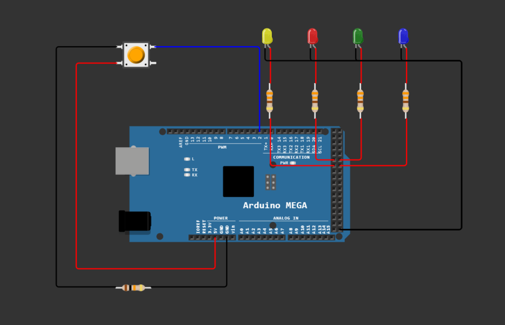

# Bonus Project for Embedded Systems (IN8014)

Our little controller turns the light on and off when clicking once, changes the color when double clicking, and changes the light animation when holding the button down for at least one second.

To run the code yourself, start a new project on [Wokwi](https://wokwi.com/) (it doesn't matter which Arduino you choose as we will replace the source code anyway) and copy and paste the contents of our `diagram.json` file.
If some of the wires don't connect, just insert a character and delete it again.
This will cause the editor to reload the visual representation.
Then copy the code from both `ButtonReader.ino` and `LightController.ino` and paste them into `sketch.ino`.
To start the simulation click the play button.

We can't guarantee that everything will work perfectly, as Wokwi does seem to have some issues, but some features should work.
